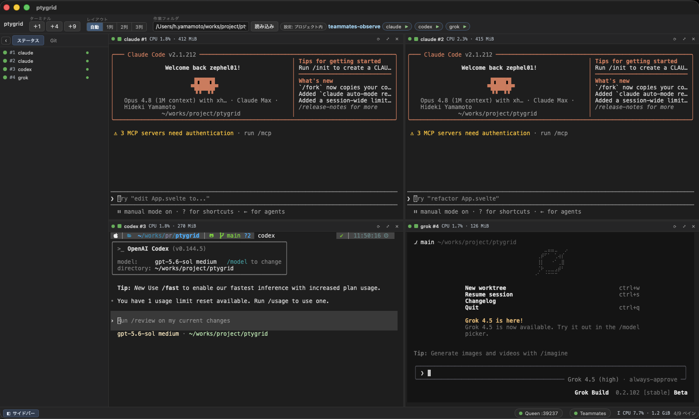

<div align="center">

# ptygrid

**複数の AI エージェント CLI を1画面で並行実行・協調させる、軽量ネイティブターミナル**

Claude Code / Codex / Grok をスプリットペインで同時に走らせ、内蔵 MCP サーバー **Queen** で
エージェント同士が「他ペインを読む・指示する・起動する」を実現します。

[](https://v2.tauri.app/)
[](https://www.rust-lang.org/)
[](https://svelte.dev/)
[](https://modelcontextprotocol.io/)
[](#動作環境)
[](#ロードマップ)

[ユーザーガイド](docs/userguide.md) · [設計ドキュメント](docs/design.md) · [Linux / Windows移植](docs/porting.md) · [競合調査](docs/competitive-landscape.md) · [トラブルシューティング](docs/troubleshooting.md)



</div>

---

> [!NOTE]
> 旧仮称 **multi-terminal** から **ptygrid**(pty + grid)に改名しました。設定ファイル名も `ptygrid.yml` に変更済みです（旧 `mterm.yml` は互換のため引き続き読み込め、両方ある場合は `ptygrid.yml` が優先されます）。

## ✨ 特徴

- 🪟 **スプリットグリッド(最大9ペイン)** — リサイズ自由。ペインごとに restart / close / maximize、状態ドット(running / exited / restarting + exit code)
- 📝 **config-as-code(`ptygrid.yml`)** — エージェントとプロセスを YAML で定義。autostart で一斉起動、変更を監視して Reload
- 👑 **Queen(内蔵 MCP サーバー)** — エージェント CLI が MCP ツールとして他ペインを読む・書く・起動する・通知する
- 📌 **共有Pins / Notes** — project単位の永続メモをQueen経由で共有。revision競合検出で同時更新の上書き消失を防止
- 📬 **永続Inbox / Reply** — 安定message ID、acknowledgement、thread correlation付きの非同期agent間通信
- ⏳ **Cancellable Await** — cursor以降のInbox到着をbusy pollingなしで待機。timeoutとMCP cancellation対応
- 🔒 **許可リスト方式の spawn** — `spawn_agent` は ptygrid.yml で定義された名前しか起動できない。bind は 127.0.0.1 のみ
- 🎯 **曖昧でない宛先指定** — 全ペインに`#id`を表示。同名CLIが複数なら`agent: "#3"`で厳密指定し、名前の推測送信を拒否
- 🔁 **autorestart** — never / on-failure / always(連続5回で打ち切り)。restart してもペインとセッション ID を維持
- 🌿 **Git / Worktree** — status・diff・stage・unstage・commitと、定義ごとの任意linked-worktree分離
- 📊 **リソース監視** — ペインごとのprocess tree CPU/RSSと、ツールバーの全セッション合計
- 💾 **論理セッション復元** — project・ペイン順・layout・定義を保存し、任意の`resume` commandで再起動
- 🧹 **読みやすい出力共有** — `read_output` はペイン寸法に合わせてANSIカーソル移動・画面消去・alternate screenを再構成したテキストを返す(TUIの全画面再描画・スピナー残骸対策)
- 🪶 **ネイティブで軽量** — Electron 不使用。Rust + Tauri v2 + portable-pty

## 🏗️ 仕組み

```
┌─ ptygrid ────────────────────────────────────────────┐
│  ┌─────────┐  ┌─────────┐  ┌─────────┐               │
│  │ claude  │  │ codex   │  │ grok    │  ← 各ペイン = │
│  └────┬────┘  └────┬────┘  └────┬────┘    PTY + xterm.js
│       │            │            │                     │
│  ┌────┴────────────┴────────────┴──────────────────┐ │
│  │ Session Manager / Monitor / Git / State         │ │
│  │ portable-pty · sysinfo · installed git          │ │
│  ├─────────────────────────────────────────────────┤ │
│  │ 👑 Queen — MCP server (rmcp, streamable HTTP)   │ │
│  │    list_agents / read_output / send_message /   │ │
│  │    spawn / notify / pins / notes / inbox / await│ │
│  │    durable data: SQLite (project-scoped)        │ │
│  └─────────────────────────────────────────────────┘ │
└──────────────────────────────────────────────────────┘
         ▲ MCP (http://127.0.0.1:39237/mcp)
         └─ ペイン内の各エージェント CLI が Queen をツールとして呼ぶ
```

ペイン内の Claude Code に「**codex の出力を読んで要約して**」と頼むと、Queen 経由で実際に動きます。
同じCLIが複数ある場合は「**`#3`にレビューを依頼して**」のように、ヘッダーに表示された
session IDを指定します。

## 🚀 クイックスタート

前提: Rust (rustup), Node.js 20+, Git、およびOS別のTauri依存

- macOS: Xcode Command Line Tools
- Ubuntu / Debian: `libwebkit2gtk-4.1-dev`など（詳細は[Linuxセットアップ](docs/userguide.md#linuxubuntu--debian)）

```bash
git clone https://github.com/zephel01/ptygrid.git
cd ptygrid
npm install
npm run tauri dev    # 初回は Rust ビルドで数分
```

ウィンドウが開き、`$SHELL`(zsh 等)が1ペインで起動します。

### エージェントを定義する

ツールバーの「作業フォルダ」欄に対象フォルダ（例 `~/works/hoge`。先頭 `~` 可）を入れて読み込みます。
設定ファイル `ptygrid.yml` は **作業フォルダ内 → アプリ起動フォルダ → `~/.ptygrid/`** の順に探索されるので、
プロジェクト直下に置いても、複数プロジェクト共通の設定を `~/.ptygrid/ptygrid.yml` に置いてもかまいません
（旧名 `mterm.yml` は作業フォルダ内のみ互換読み込み）([注釈付きサンプル](ptygrid.example.yml) / [用途別サンプル集](example/README.md)):

```yaml
project: my-app

agents:
  - name: claude
    cmd: "claude"
    cwd: "."
    autostart: true
  - name: codex
    cmd: "codex"

processes:
  - name: web
    cmd: "npm run dev"
    autorestart: on-failure
```

初めて読み込むプロジェクト（作業フォルダ／起動フォルダ由来の `ptygrid.yml`）では、`autostart` の
コマンドを勝手に実行しないよう **「このフォルダを信頼しますか？」の確認**が一度だけ出ます。
「信頼して起動」で以後そのフォルダは記憶され、確認は出ません（`~/.ptygrid` のグローバル設定は常に信頼済み）。
詳細は [docs/userguide.md](docs/userguide.md) の「信頼確認」を参照。

### Queen を各 CLI に登録する

ツールバー右の「● Queen :39237」バッジをクリックすると、認証トークン込みの登録コマンドが
コピーされます。`/mcp` は token + Host/Origin 検証で保護されており、URL には `?token=<token>`
が付きます。**トークンはアプリ起動ごとに変わる(非永続)ため、再起動したら再登録してください。**
下記の `<token>` はプレースホルダなので、実際はバッジのコピーを使ってください。

```bash
# Claude Code(-s user 必須。local スコープはディレクトリ限定になる罠あり)
claude mcp add -s user --transport http queen "http://127.0.0.1:39237/mcp?token=<token>"

# Grok CLI
grok mcp add -s user -t http queen "http://127.0.0.1:39237/mcp?token=<token>"
```

```toml
# Codex CLI (~/.codex/config.toml)
[mcp_servers.queen]
url = "http://127.0.0.1:39237/mcp?token=<token>"
```

詳しい使い方は **[ユーザーガイド](docs/userguide.md)** を、ハマりどころは [トラブルシューティング](docs/troubleshooting.md) を参照してください。

## 🧰 技術スタック

| レイヤ | 採用技術 |
|---|---|
| アプリ枠 | Tauri v2(Rust バックエンド + WebView) |
| PTY | portable-pty 0.9(wezterm 製) |
| MCP サーバー | rmcp(公式 Rust SDK)/ streamable HTTP |
| フロント | Svelte 5 (runes) + @xterm/xterm + svelte-splitpanes + Vite 6 |
| 設定 | serde_norway(YAML)+ notify(ファイル監視) |
| Git | インストール済み`git`をshellを介さず実行 |
| リソース監視 | sysinfo(process treeを共有samplerで集計) |
| Queen永続データ | rusqlite + bundled SQLite(WAL) |

## ✅ 検証済み

- `pty-core-check/`(portable-pty 単体スモークテスト): 出力キャプチャ・resize・kill を実走確認
- `mcp-server-check/`(rmcp 単体スモークテスト): initialize → tools/list → tools/call を実走確認
- `cargo check` + `cargo test`(PTY/session・Git・worktree・state・resource・Queen、61 tests): 合格
- `npm run build` + `svelte-check`: 0 errors / 0 warnings
- GitHub Actions: macOS 14 / Ubuntu 22.04でfrontend、Rust tests、clippy、Tauri native buildを検証

### 開発時のチェック

```bash
npm run check
npm run build
cd src-tauri
cargo check
cargo test
cargo clippy --all-targets --all-features
```

IPC / MCP schemaを変更する場合は[CONTRACT.md](CONTRACT.md)、release進捗は
[docs/phase3.md](docs/phase3.md)、user-visibleな操作は[ユーザーガイド](docs/userguide.md)も
同じ変更で更新します。

## 🗺️ ロードマップ

- [x] **Phase 0** — 単一 PTY ペイン
- [x] **Phase 1** — マルチペイン + config-as-code(現 `ptygrid.yml`, autostart/restart)
- [x] **Phase 2** — Queen(内蔵 MCP サーバー: 基本5 tools)
- [x] **Phase 3.0–3.8** — Git diff/commit・worktree分離・logical resume・リソース監視・Queen pins/notes/inbox/reply/await(18 tools)
- [x] **Phase 3.9** — Linuxテスト対応(PATH復元、Ubuntu CI、`.deb` / AppImage packaging)

方向性の背景は [競合調査](docs/competitive-landscape.md) を参照(worktree 隔離系ではなく「同一画面で協調する系」を選んでいます)。
Phase 3 は [段階リリース計画](docs/phase3.md) に沿って、互換性を保ちながら機能単位で進めます。

## 📚 ドキュメント

| ドキュメント | 内容 |
|---|---|
| [docs/userguide.md](docs/userguide.md) | インストール・画面の見方・ptygrid.yml リファレンス・Queen の使い方 |
| [docs/design.md](docs/design.md) | 設計ドキュメント(OSS 調査・スタック選定・アーキテクチャ) |
| [docs/competitive-landscape.md](docs/competitive-landscape.md) | 類似ツールの競合調査とポジショニング |
| [docs/troubleshooting.md](docs/troubleshooting.md) | 実際のドッグフーディングで判明した罠と対処 |
| [docs/phase3.md](docs/phase3.md) | Phase 3の段階独立リリース計画と進捗 |
| [docs/plan.md](docs/plan.md) | 作業計画（現在地サマリ・次の作業・バージョニング規約） |
| [docs/porting.md](docs/porting.md) | Linuxテスト対応状況、Linux build/package手順、Windows移植計画 |
| [CONTRACT.md](CONTRACT.md) | backend ⇄ frontend の IPC 契約(開発者向け) |

## 動作環境

**macOSを主対象**とし、Linuxは**テスト対応（beta）**です。Linuxのbuild・配布経路は
x86_64 Ubuntu 22.04 / Debian 12相当を基準にし、`.deb`とAppImageを生成できます。
AppImageはglibc互換性のためUbuntu 22.04 CIでbuildしますが、Linux各環境での安定動作は
今後の実機検証とフィードバックを通して確認します。
Windowsはportable-pty/ConPTYの分岐を持ちますが、foreground process検出と実機検証が未完了です。

## License

未定(公開時に決定予定)
