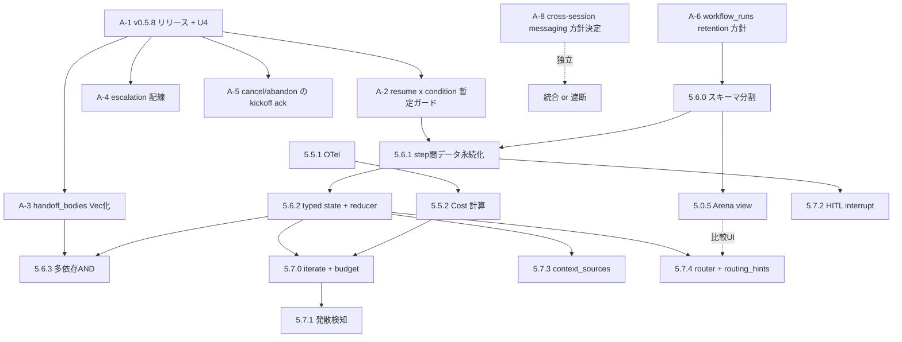

# 次期機能実装の整理 — LangGraph 知見と cross-session messaging を既存計画へ統合する

作成日: 2026-08-07 / 実装基準: `main` + `feat/step-timing-5.0.6`（plan.md 2026-08-04 断面）
前段: `docs/inside/phase-adaptive-orchestration.md`（2026-07-24、Phase 5.7 提案。**未採用のまま**）
接地: `orchestrator.rs` / `queen_store.rs` / `config.rs` を実読、`CONTRACT.md` / `plan.md` /
`spec-phase5-5.md` / `spec-phase6-0.md` / `ptygrid-yml-guide.md` を突き合わせ（2026-08-07）
方針: **足元固め優先**（plan.md §3 の「新機能を足す前に足元を確定させる」を継承）

---

## 0. 結論（先に）

外部調査（LangGraph、Claude Code の cross-session messaging）から持ち帰るべきものを洗い出した結果、
**その大半が「新機能の提案」ではなく「plan.md のバックログに既に載っている穴の、原理的な直し方」**
だった。つまり本メモは新しいロードマップを足すものではなく、**既存バックログの並べ替えと、
その根拠の補強**である。

確定した要点は 4 つ。

1. **コード実読で、plan.md に載っていない不整合を 1 件発見した**（→ §2.1）。`StepOutcome.reply_body`
   は `#[serde(skip)]`（`orchestrator.rs:180-186`）なので resume 後は必ず `None` に戻る。その結果
   **`condition:` を持つ run を resume すると、上流が成功していても下流が `Skipped` ではなく
   `Failed` になる**（`orchestrator.rs:2386-2393`）。`onEach` だけは resume を明示拒否している
   （`orchestrator.rs:1393-1399`）が、`condition` / `handoffTo` に同等のガードは無い。
   **足元固めの最優先はこれ**。
2. LangGraph の checkpoint スキーマ（`checkpoints` + `writes` の 2 テーブル）は、ptygrid の
   `workflow_runs`（**run 1 行に `steps_json` を毎回丸ごと書き直す**、`queen_store.rs:33-45` /
   `orchestrator.rs:2567-2580`）を分割する設計指針としてそのまま使える。**これは iterate ループ・
   Arena view・run 履歴 UI のいずれにも先立つ前提工事**であり、後から入れると移行が要る。
3. Phase **5.6 / 5.7 は完全に空き番**であることを CONTRACT.md / plan.md の全 grep で確認した。
   2026-07-24 に提案された「Phase 5.7 Adaptive Orchestration」は **docs/inside の提案書の中だけに
   存在し、CONTRACT.md にも plan.md にも 1 行も反映されていない**。本メモはこの提案を、LangGraph
   知見で裏付けし直したうえで正式に採番へ載せることを提案する。
4. Claude Code の cross-session messaging（v2.1.224+、macOS/Linux）は Queen の `send_message` /
   `inbox` と機能が重なる。**ptygrid の 9 ペインは同一マシン・同一ユーザーなので、放置すると
   Queen の統制（許可リスト・宛先厳密化・監査可能な inbox）を迂回する裏チャネルが常時開く**。
   これは新機能というより**設計判断を迫られている外部変化**で、判断を先送りするコストがある（→ §5）。

**採番の提案**: 足元固めは新採番せず v0.5.8 と直後の patch で消化。新規は **Phase 5.6「Durable
Orchestration」**（永続化と state の表現力）と **Phase 5.7「Adaptive Orchestration」**（反復・予算・
ルーティング）の 2 tier に分ける。ただし**タグは v0.5.9〜v0.5.12 が Phase 5.5.x に予約済み**なので、
順序を変えるならタグ表の振り直しが要る（→ §4）。

---

## 1. 前提: いまの足元（確定事実のみ）

### 1.1 実装済みで動くもの

`ptygrid-yml-guide.md` §1 のマトリクスで「実行時に効く」が ✅ なのは、pipeline / fan-out /
supervisor / handoff、`dependsOn` / `fanOut` / `joinOn`（all / any / N / reply / stream）/
`timeoutMs` / `retry` / `condition` / `handoffTo` / `onEach: reply` / `onFailure` / `kickoff` /
`autoClose` / `close_on_exit` / workflow resume。**5.0.4 の実行層と 5.0.7 のストリーミングまで
入っている**のが現在地。

### 1.2 ❌ のまま残っているのは 2 行だけ

| 項目 | 状態 | 出典 |
|---|---|---|
| `arena: true` | パースは通るが Arena UI 自体が無い | ptygrid-yml-guide.md §1 |
| escalation（retry 枯渇時の外部通知） | 枯渇判定は発火するが配送経路が無い | 同上 / plan.md §3 P3 |

### 1.3 コードで裏取りした「表現力の天井」

| # | 事実 | 場所 | 性質 |
|---|---|---|---|
| a | step 間で運ばれるデータは **プレーンな `String` 1 本だけ**。構造化データは無い | `orchestrator.rs:924-945`（`deliver_kickoff`）/ `1768-1779`（`compose_kickoff`） | — |
| b | **workflow 実行中の共有 state は存在しない**。`WorkflowRun` は run_id / name / state / 時刻 / steps のみ | `orchestrator.rs:250-269` | — |
| c | `handoff_bodies` は 1 ターゲットにつき本文 1 本。2 本目は**警告もエラーも無く捨てる** | `orchestrator.rs:2165-2185`（`if bodies.contains_key(target) { continue; }`） | **fail-silent** |
| d | `condition` の多依存は `config.rs:850-856` が load 時に拒否。実行時（`.first()` しか見ない）には到達しない | `config.rs:850-856` / `orchestrator.rs:2353-2398` | **fail-loud** |
| e | 永続化は run 1 行に `steps_json` を**毎回丸ごと再シリアライズ**。step 単位のレコードは無い | `queen_store.rs:33-45` / `orchestrator.rs:2567-2580` | — |
| f | `workflow_runs` だけ**件数上限も DELETE も無い**（pins/notes/inbox にはある） | `queen_store.rs`（`enforce_limit` 対象外） | 単調増加 |
| g | `workflow_runs.error` は upsert のたびに `NULL` で潰される。abandon マーカー専用 | `queen_store.rs:1003, 1011` | 落とし穴 |
| h | コスト / トークンの集計は**一切存在しない**。時間は step 単位のみで run 集計関数が無い | `orchestrator.rs` 全体 grep | — |
| i | `PTYGRID_MAILBOX` は **pane 再利用時に更新されない**（`resolve_def` を通らないため） | `orchestrator.rs:480-521` | 潜在バグ |

> **c と d の非対称が重要**: 同じ「多対一が書けない」でも、handoff は黙って落ち、condition は
> load 時に弾かれる。plan.md §3 のバックログは両方を `orchestrator.rs` の問題として書いているが、
> **d は config 側と実行側の 2 層を同時に直さないと効かない**。なお連結に使う
> `handoff::merge_reply_bodies` は既に実装済み（`orchestrator.rs:1723-1731`、`detect_reply_completions`
> から使用中）なので、c の修正は新規ロジックをほとんど書かずに済む。
>
> **追記（2026-08-13）**: c は `502e27c` で解消済み。ただし**方式は上記と異なる** — `merge_reply_bodies`
> の流用ではなく、バイト上限を source 間で分配する `handoff::merge_carried_bodies` を新設して使い、
> `handoff_bodies` の返り値は `HashMap<String, String>` のまま保った（→ CONTRACT 続報13 / 続報14）。

### 1.4 未消化の実機検証

U4（同名 workflow 並行 run の mailbox）が**未実施**で、v0.5.8 の項目 5 かつ 5.0.4 追補 / 5.0.6（案）の
両方がこれを待っている。ほかに U6（host モード）・U7（Linux 常用）・U8（Windows）・U10（5.5.0 記録なし）・
U12（残 3 点）・U13（残 4 点）・U14（残 3 点）。

---

## 2. 新知見の位置づけ

### 2.1 LangGraph — 「新機能」ではなく「既存の穴の直し方」

LangGraph（v1.0 GA 2025-10-22、コアは MIT）から取れるものは 5 つに絞られる。**そのうち 4 つが
plan.md のバックログに既に載っている項目の解法**である点が本メモの主眼。

| LangGraph の設計資産 | ptygrid 側の既存の穴 | 新規性 |
|---|---|---|
| `checkpoints` + `writes` の 2 テーブル、`parent_checkpoint_id`、`checkpoint_ns` | §1.3-e（run 丸ごと再シリアライズ）、§1.3-f（retention なし）、resume の粒度 | **既存の穴の解法** |
| typed state channel + reducer（分岐は state に対して行う） | §1.3-a/b（String 1 本・共有 state なし）、バックログ「cross-model review の突き合わせ」 | **既存の穴の解法** |
| Evaluator-Optimizer + `recursion_limit` / `RemainingSteps` | 反復機構が retry しか無い（§3.2） | 新規 |
| `interrupt()` / `Command(resume=…)` の HITL | Queen `await` に人間待ちの型区別が無い | 新規 |
| Send API + supervisor の `output_mode` | phase-adaptive 提案の `context_sources` / router | 新規（提案済み・未採番） |

**最重要の発見**（コード実読で判明、plan.md に未記載）:

> `StepOutcome.reply_body` は `#[serde(skip)]`（`orchestrator.rs:180-186`）で永続化されない。
> `resume_workflow` は `Succeeded` の step を維持する（`orchestrator.rs:1405-1414`）が、その
> `reply_body` は復元されない（`orchestrator.rs:1435-1439` で明示的に `None`）。
> 結果、**resume 後に `condition:` を評価すると「上流が返信を残さず完了した」と誤判定して
> `Failed`**（`orchestrator.rs:2380-2394` の 3 分岐目）。エラーメッセージも「上流に kickoff: を
> 付けろ」という的外れな内容になる。`handoffTo` の carry も静かに落ちる。
> `onEach` だけが `orchestrator.rs:1393-1399` で resume を明示拒否しており、
> **`condition` / `handoffTo` には同等のガードが無い**。

これは LangGraph が `writes` テーブルで解いている問題（superstep 内の中間書き込みの保存）と
同じ形をしている。**「step 間データを永続化する」か「resume 拒否リストに足す」かの二択**で、
前者が本筋、後者が暫定。

> **追記（2026-08-13）**: 暫定側は `3666fef` で実装済み。ただし**方式は上記と異なる** — `onEach` の門と
> 同じ「定義だけを見て拒否リストに足す」ではなく、collapse 後のスナップショットを見る別関数
> `lost_carry_blocker` になった（同じ定義でもクラッシュ地点によって復旧可否が変わるため）。
> その判定が中継 step を取りこぼしていた件は `fix(5.0.1): count a handoffTo target as a producer too`
> で修正（→ CONTRACT 続報12 / 続報14）。

### 2.2 Claude Code cross-session messaging — 外部変化への対応

Claude Code v2.1.224 以降（macOS / Linux、有効化操作なし）で、同一マシンのセッションが
`ListAgents` / `SendMessage` で相互に発見・通信する。各セッションが inbox ソケットを bind し、
パスは `CLAUDE_CODE_MESSAGING_SOCKET` として hooks / Bash に export される。

| 観点 | Queen | ネイティブ cross-session messaging |
|---|---|---|
| 対象 | Claude / Codex / Grok など任意の CLI | **Claude Code 同士のみ** |
| 永続性 | SQLite（stable mailbox / ack / thread / revision） | **揮発。テキスト配送のみ** |
| 配送先 | live PTY 書き込み（`send_message`）と追記 inbox（`send_inbox`）の 2 経路 | inbox ソケット |
| 配送タイミング | **制御なし**。CONTRACT.md:199 が「composer に未送信テキストが残りうるので送信前に `read_output` 推奨」と注記 | **実行中のツールを中断しない**（ターン間に読ませる / idle なら新ターン開始） |
| オーケストレーション | DAG / resume / spawn 許可リスト | 無し |
| 他ペインの画面を読む・起動する | `read_output` / `spawn_agent` | 無し |

**ptygrid にとっての含意は 3 つ。**

1. **統制の迂回**: ptygrid の 9 ペインは同一マシン・同一ユーザーなので、条件を満たせば
   **ユーザーが何もしなくてもペイン間でネイティブ通信が成立する**。Queen の「許可リスト方式の
   spawn」「曖昧でない宛先指定」「監査可能な inbox」という設計思想と正面から衝突する。
2. **取り込める実利**: ネイティブ側の配送セマンティクス（実行中ツールを中断しない）は、
   ptygrid の `send_message` が持っていないもの。`CLAUDE_CODE_MESSAGING_SOCKET` は環境変数で
   取れるので、**Queen が PTY 直書きの代わりにソケットへ投函する配送経路**を持てる可能性がある。
3. **命名の整合**: ptygrid は既に `PTYGRID_MAILBOX` を env で注入している（`orchestrator.rs:509-521`）。
   ペイン起動時に `--name <定義名>#<id>` を渡せば、ネイティブ側の名前空間を ptygrid の宛先規約
   （`#3`）と一致させられる。

**先に決めるべきは「統合か遮断か」**。遮断（ペインに `crossSessionInbound: refuse` と
`SendMessage`/`ListAgents` の deny を注入し、通信は必ず Queen 経由）も、委譲（Claude 同士は
ネイティブに任せ、Queen は Codex/Grok の橋渡しと永続層に専念）も、どちらも一貫した設計になりうる。
**config-only で今日試せる**（→ §3 Stage A-8）。

---

## 3. リリース分割案

足元固め優先の方針に従い、**Stage A（新採番なし）→ Stage B（5.6）→ Stage C（5.7）**の順に置く。
Stage A が終わるまで B/C には着手しない。

### Stage A — 足元固め（新採番なし。v0.5.8 と直後の patch で消化）

| # | 項目 | 根拠 | Completion gate | サイズ |
|---|---|---|---|---|
| A-1 | **v0.5.8 を出す**（plan.md §4 の項目 1〜7）。U4 の消化を含む | plan.md §4 | タグ作成。3 ファイルの version 一致 | 既定 |
| A-2 | **resume × `condition` / `handoffTo` の不整合を塞ぐ** | §2.1（新規発見） | 暫定: `condition` / `handoffTo` を含む run を `onEach` と同じく resume 拒否（`orchestrator.rs:1393-1399` に条件追加）。本筋は B-1 で永続化。**追記（2026-08-13）: 暫定は `3666fef` で実装済み。方式は左記と異なり、定義ベースの拒否リストではなく collapse 後のスナップショットを見る別関数 `lost_carry_blocker`（→ CONTRACT 続報12 / 続報14）** | **S**（暫定）/ M（本筋） |
| A-3 | **`handoff_bodies` の fail-silent 解消** | §1.3-c | `HashMap<String, String>` → `Vec` 化し `merge_reply_bodies`（既存）で連結。同一 target 複数 `handoffTo` が両方 kickoff に載る unit test。**追記（2026-08-13）: `502e27c` で実装済み。方式は左記と異なり、返り値は `HashMap<String, String>` のままで、連結は新設の `merge_carried_bodies`（→ CONTRACT 続報13 / 続報14）** | **S** |
| A-4 | **escalation 配線**（❌ 2 行のうち 1 つ） | plan.md §3 P3 | retry 枯渇で 4.4.2 の通知経路（OS / Slack / …）へ 1 通出る | S |
| A-5 | **cancel / abandon の kickoff ack** | plan.md バックログ 1 | `cancel_workflow`（`orchestrator.rs:1246-1302`）/ `abandon_workflow`（`1471-1480`）が未 ack kickoff を ack する。次 run が死んだ run の指示を拾わない | S |
| A-6 | **`workflow_runs` の retention 決定** | §1.3-f | 件数 or 日数の上限と DELETE を入れる。**B-1 のスキーマ分割前に方針だけでも決める**（後から移行するとコストが上がる） | S |
| A-7 | 残る実機検証: U14（3 点）/ U12（3 点）/ U13（4 点）/ U10 | plan.md §2 | 各項目のスクリーンショット記録 | — |
| A-8 | **cross-session messaging の実機確認と方針決定** | §2.2 | ペインの Claude Code で `/list-agents` を叩き、9 ペインが相互に見えるかを確認。見えるなら「統合 / 遮断 / 放置」を判断して CONTRACT に記録 | **S（config のみ）** |

> A-2 は**暫定を先に入れることを推奨**する。本筋（step 間データの永続化）は B-1 の一部だが、
> それまでの間「resume したら緑のはずの run が赤くなる」状態が続くのは、5.0.1 で作った
> resume の価値を損なう。

### Stage B — Phase 5.6「Durable Orchestration」（永続化と state の表現力）

前提: Stage A 完了。**`user_version` の採番衝突に注意**（→ §4.2）。

| Release | Scope | Completion gate | サイズ |
|---|---|---|---|
| **5.6.0** | **`workflow_runs` のスキーマ分割**。run 1 行 + step 1 行の 2 テーブル化（LangGraph の `checkpoints` / `writes` に相当）。`parent_run_id` 相当を持たせて fork を表現可能にしておく。retention（A-6 の方針）を同時に入れる | 200ms tick の書き込みが run 全体の再シリアライズでなく差分になる。既存 run の migration が通る。`steps_json` 経路との互換パスを CONTRACT に記録 | **M〜L** |
| **5.6.1** | **step 間データの永続化**。`reply_body` / `kickoff_root_msg_id` を（`#[serde(skip)]` をやめて）step レコードへ保存。A-2 の暫定拒否を解除し、`condition` / `handoffTo` を持つ run が正しく resume する | resume 後に `condition` が正しく評価される（`Failed` にならない）。`handoffTo` の carry が復元される。**`onEach` の resume 拒否も解除できるか**をここで判定 | M |
| **5.6.2** | **typed state + reducer（最小形）**。step の出力から state へ書き出す `emit:`（regex / JSON ブロック / enum）と、state に対する分岐 `when:`。reducer は `last` / `append` / `add` / `max_by` の 4 つから開始 | `condition:`（regex）と併存し、既存 workflow が非回帰。`when:` が fan-out/join をまたいで評価できる。join の合成順が到着順でなく step id 順で決定論的 | **L** |
| **5.6.3** | **多依存 AND**。`condition` / `when` が複数依存を取れるようにする（`config.rs:850-856` の 1 本制限緩和 + `orchestrator.rs:2366` の `.first()` 解消） | 「2 体のレビュアーが両方 ACCEPT なら進む」が設定で書ける（plan.md バックログ 5 の解消） | M |

**Phase 5.6 完了ゲート**: 「実装 → 別モデル 2 体が並行レビュー → 両方の結果を突き合わせて判定」が
**設定だけで書け**、途中でアプリを落として resume しても緑のまま完走する。

### Stage C — Phase 5.7「Adaptive Orchestration」（反復・予算・ルーティング）

前提: 5.6.2 完了（typed state が無いと iterate の停止条件も router の分類結果も置き場が無い）。
2026-07-24 の `phase-adaptive-orchestration.md` の提案を、LangGraph 知見で補正したもの。

| Release | Scope | Completion gate | サイズ |
|---|---|---|---|
| **5.7.0** | **有界 iterate ループ + budget**。`iterate: {body, until, budget}`。budget は多次元（`iterations` / `wallClock` / `tokens?` / `costUsd?`）。**`onBudgetExceeded` の脱出 step を必須**にし、エラーで落とさず最善解でまとめさせる。Verifier は PASS/FAIL でなく `score` を持ち best-so-far を state に保持 | 反復が N 回以内に収束、予算超過で hard-stop せず `onBudgetExceeded` に降りる。再起動 resume で反復回数を保持。**非循環 DAG 不変を壊さない**（`detect_cycle` は据え置き、driver 側の再 spawn 回数制御として実装） | **L** |
| **5.7.1** | **発散検知**（LangGraph には無い ptygrid 独自）。直近 2 周回の成果物ハッシュ / score が同一なら「進捗なし」で早期打ち切り | 同じ修正を繰り返すループが budget を使い切る前に止まる | S |
| **5.7.2** | **HITL `interrupt` step**。payload をペインに描画し人間の入力を resume 値にする。Queen `await` に `waitingFor: agent \| human` を追加。中断は制御フロー（`enum StepOutcome { Done / Interrupted / Failed }`）として型で表す | アプリを閉じて翌日再開できる。並列 interrupt が ID 付きでペインにバッジ表示される | M |
| **5.7.3** | **`context_sources`（access-list）**。step ごとに見える上流出力を宣言。`mode: full \| last \| summary \| tail:N`（LangGraph supervisor の `output_mode` 相当） | 宣言した source のみ kickoff に載る。fan-out の分岐度（多様性）が全共有時より上がることを実測 | M |
| **5.7.4** | **router step + `routing_hints`**。分類は **structured output（JSON / enum）で受けて state に書く**（regex ではない）。9 ペイン制約があるので Send API 相当は「タスクキュー + `maxParallel`」のワーカープールとして実装 | router が代表タスクを hint 優先 worker に振る。総当たり比で e2e コストが下がることを数値で確認 | **M〜L** |

### 既存フェーズとの関係（順序への影響）

| 既存 | 本メモからの影響 |
|---|---|
| **5.0.5 Arena view** | **5.6.0 の後ろに置くべき**。Arena は「同じ親から fork した兄弟の比較」であり、`parent_run_id` を持つスキーマの上に載せれば自然に実装できる。先に作ると後で作り直す |
| **5.5.1 OTel / 5.5.2 Cost** | 独立して進められる。LangGraph からの示唆は「独自属性でなく `gen_ai.*` セマンティック規約に乗る」「step の親子を span 階層にする」「budget を span attribute + metric に出す」。**5.7.0 の budget が cost.rs（5.5.2）を必要とするので、5.5.2 は 5.7.0 より前が望ましい** |
| **Memory + Provider（番号未定）** | LangGraph の 3 層整理（static context = pins / 動的 state = workflow state・inbox / long-term store = notes）をそのまま採用できる。notes を `ns + key → JSON` + `search` の BaseStore 型に寄せる。5.6.2 の state が入ってから位置づけが確定する |
| **6.0.0 Security** | `user_version` の採番が 5.6.0 とぶつかる（→ §4.2） |

---

## 4. 採番とタグ

### 4.1 Phase 番号

全 grep の結果、**5.6 系・5.7 系は CONTRACT.md にも plan.md にも一度も登場しない完全な空き番**。
5.0.8 以降も空いている。よって Stage B / C を 5.6 / 5.7 に置くことに衝突は無い。

> **注**: 2026-07-24 の `phase-adaptive-orchestration.md` が提案した「Phase 5.7 Adaptive
> Orchestration」は、**CONTRACT.md にも plan.md にも取り込まれていない**（提案書の中だけに存在）。
> 本メモはその番号を踏襲するが、正式採用するなら CONTRACT.md への追記と plan.md §1 の表への
> 行追加が要る。

### 4.2 `user_version` の衝突（要判断）

`spec-phase6-0.md` / plan.md §1 は **6.0.0 が `user_version` 4 の 3 テーブル同時導入**を予約している。
一方 5.6.0（スキーマ分割）は現在の 3 → 4 を消費する。**5.6 を 6.0 より先に出すなら、6.0.0 は
`user_version` 5 になる**。`queen_store.rs:219-226` は未知の新しい version を**開かずにエラー**に
するので、番号の取り合いは後戻りできない。着手前に CONTRACT.md へ記録すること。

migration の書き方は `queen_store.rs:227-328` の定型に従う（`BEGIN IMMEDIATE` 一括 / 全 DDL に
`IF NOT EXISTS` / 失敗時 ROLLBACK / スキーマ文字列は定数化）。

### 4.3 タグ

現状 v0.5.9〜v0.5.12 は Phase 5.5.1〜5.5.4 に予約済み（`spec-phase5-5.md` §9、plan.md §4 と一致）。
素直に積むと **5.6 = v0.5.13 以降、5.7 = さらにその後**になる。

判断が要るのは次の 1 点。**5.6.0（スキーマ分割）を 5.5.x より先に出すかどうか。** 先に出す論拠は
「Arena（5.0.5）も iterate（5.7.0）も run 履歴 UI も 5.6.0 の上に載るので、遅らせるほど手戻りが
増える」。後に回す論拠は「5.5.1/5.5.2 はバックエンド完結で UI 変更が要らず、5.5.0 が作った
`_meta.traceparent` の受け口が宙に浮いたままである」。**先に出すならタグ表（spec-phase5-5.md §9）の
3 度目の振り直しになる**ので、ここは判断待ちとする。

> 併せて記録: `spec-phase6-0.md` §9 のバージョン割当（「5.5 の v0.5.10 を消化した後 6.0 は
> v0.6.0〜」）は 2 度目の繰り下げを反映しておらず**古い**。同 §9 は Phase 6.0 の段階見出しを
> 「5.0.0〜5.0.5」と誤記してもいる。次に触るとき直す。

---

## 5. 依存グラフ

クリティカルパスは **A-6 → 5.6.0 → 5.6.1 → 5.6.2 → 5.7.0**。A-2 / A-3 / A-4 / A-5 / A-8 は
互いに独立で、どの順でも並行できる。

---

## 6. 実装タッチポイント（コード実読に基づく注意点）

新機能を足す前に知っておくべき、**コードを読んで初めて分かった落とし穴**を 6 点。

1. **`workflow_runs.error` は再利用できない**。upsert が INSERT でも UPDATE でも `error = NULL` を
   書く（`queen_store.rs:1003, 1011`）ため、このカラムは実質「abandon マーカー専用」。run レベルの
   失敗要約を持たせたいなら別カラムが要る。
2. **永続化は「変化があった tick だけ」で、しかも run 全体の JSON 再シリアライズ**
   （`orchestrator.rs:4068-4072` / `2567-2580`）。`STREAM_MAX_UNITS = 64`（`orchestrator.rs:77`）が
   存在する理由がまさにこれで、**ループ機能や step の動的生成を足すと 200ms ごとの書き込みコストに
   直結する**。5.6.0 のスキーマ分割は iterate の前提工事でもある。
3. **`PTYGRID_MAILBOX` は pane 再利用時に更新されない**（`orchestrator.rs:480-521`）。現状は
   `onEach` が常に `reuse_existing: false` なので実害が出ていないが、**run スコープ mailbox を
   全 step に広げる案（バックログ 1 の (b)）を採るとここが最初に壊れる**。
4. **未知フィールドは黙って無視される**（`deny_unknown_fields` が config.rs に 1 つも無い）。
   forward-compat の利点の裏返しで、`emit:` / `when:` / `iterate:` を足しても古いバイナリは
   エラーにならず**黙って無視する**。ガイド §1 の「書けるが動かない」線引きを必ず更新すること。
5. **validation の入口は `parse_config` → `validate_workflows` の 1 本**（`config.rs:1585-1590`）。
   workflow 単位のフィールドは名前・steps 空チェックの直後（`config.rs:761-779` の後ろ）、step 単位は
   ループ内（`782-1117`）、全 step を見る第 2 パスは V10 と同じ位置（`1118-1141`）に足す。エラー文は
   `{ctx}: ...` 形式の規約。
6. **retry は 2 経路ある**（in-place `restart_session` / `respawn_fresh`）。前者は pane 予算を
   消費せず後者は消費する（`orchestrator.rs:3471-3517` / `3653`）。iterate ループを実装するとき、
   「同じ step を回す」を retry と別機構にするか retry の一般化にするかで、pane 予算の会計が変わる。

---

## 7. 見送り / 不採用

- **LangGraph をランタイムとして組み込む**: 不採用。Python 依存、PTY モデルとの不一致に加え、
  **Agent Server（`langgraph-api`）は Elastic License 2.0 で非 OSS**（コアライブラリは MIT）。
  製品同梱の選択肢が無い。公式 Rust SDK も無く、非公式クライアントは 2026-06 にアーカイブ済み。
- **superstep（BSP）モデルへの全面移行**: 見送り。ptygrid の 200ms tick ドライバは十分機能して
  おり、BSP に寄せる必然性は無い。取るのは「checkpoint id を単調増加させる」「join の合成を
  決定論化する」という個別の性質だけでよい。
- **LangGraph Server との相互運用（MCP / A2A 経由）**: 将来オプションとして残すが、いま採らない。
  LangGraph デプロイは MCP サーバとしても振る舞えるので、Queen が MCP クライアント機能を持てば
  「LangGraph 製エージェントをリモートワーカーとして 1 レーン扱いする」統合は技術的には可能。

**参考にすべき運用上の教訓**（LangGraph 側の失敗から）:

- **「checkpoint ≠ durable execution」**: LangGraph は状態の永続化までで、クラッシュ検知・
  再開トリガー・同時復旧の排他が利用者責務であることが本番運用の不満点になっている。
  ptygrid はデスクトップアプリとしてプロセスを直接監視できるので、**この 3 点を 5.6.0 の設計に
  最初から入れれば、LangGraph が批判されている弱点を回避できる**。
- **セキュリティ（2026-06 報道の CVE 連鎖）**: checkpointer 由来の SQL インジェクションと
  unsafe デシリアライズが RCE に連鎖した（パッチ済み）。5.6.0 でスキーマを触るときの直接の教訓は
  「メタデータ由来の文字列を SQL に埋め込まない（prepared statement を維持）」「schema version の
  検証を維持する」（`queen_store.rs:219-226` の挙動はこの点で既に正しい）。

---

## 8. 未確認・要判断

| # | 内容 | 誰が決めるか |
|---|---|---|
| 1 | **5.6.0 を 5.5.x より先に出すか**（出すならタグ表の 3 度目の振り直し） | ユーザー判断 |
| 2 | **`user_version` 4 を 5.6.0 と 6.0.0 のどちらに割り当てるか**（§4.2） | ユーザー判断。着手前に CONTRACT へ |
| 3 | **cross-session messaging を統合するか遮断するか**（§2.2） | A-8 の実機確認後に判断 |
| 4 | A-2 の暫定ガードを入れるか、B-1 まで待つか | ユーザー判断（暫定推奨） |
| 5 | `phase-adaptive-orchestration.md` は「5.7.0 config-only は ptygrid.yml で実装済み」と書いているが、**今回参照した `ptygrid.yml` は `measure-coldstart` 用の計測専用設定**（agents 1 体・workflows 1 本・team_presets なし）で、`routing_hints` も 3 ロールも見当たらなかった。作者の日常運用 config は別ファイルの可能性が高く、**先行実装の有無は未確認** | 要確認 |
| 6 | 5.6.2 の `emit:` を JSON ブロック前提にすると、エージェント側に出力規約を課すことになる。既存の `condition:`（regex）との併存期間をどれだけ持つか | 設計判断 |

---

## 参照

**コード**（`src-tauri/src/`、行番号は 2026-08-07 断面）
`orchestrator.rs`: 77 / 125-226（StepOutcome）/ 250-269（WorkflowRun）/ 480-521（spawn_step・mailbox 注入）/
924-945（deliver_kickoff）/ 1246-1302（cancel）/ 1342-1463（resume）/ 1393-1399（onEach 拒否）/
1471-1480（abandon）/ 1723-1731（merge_reply_bodies）/ 1768-1779（compose_kickoff）/ 2165-2185（handoff_bodies）/
2353-2398（condition_targets）/ 2567-2580（persist_run）/ 3471-3517・3653（retry 2 経路）/ 4068-4072（write-through）
`queen_store.rs`: 33-45（workflow_runs DDL）/ 219-226（user_version 検証）/ 227-328（migration 定型）/
674-720（send_inbox）/ 983-1025（upsert）/ 1054-1074（mark_workflow_abandoned）
`config.rs`: 624-645（WorkflowDef）/ 663-730（WorkflowStep）/ 755-1159（validate_workflows）/
850-856（condition の 1 依存制限）/ 905-973（handoffTo 検証）/ 1585-1590（parse_config）

**ドキュメント**
`plan.md` §1 進捗表 / §2 U1-U14 / §3 P1-P7 とバックログ / §4 タグ表、`CONTRACT.md` の各「予約」節
（2345 / 2352 / 2357 / 2749 / 2754 / 2774 / 2782 / 2790）、`spec-phase5-5.md` §9、
`spec-phase6-0.md` §9（**古い記述あり**）、`ptygrid-yml-guide.md` §1、
`docs/inside/phase-adaptive-orchestration.md`（未採用の提案）

**外部**
LangGraph: https://github.com/langchain-ai/langgraph （MIT）/
checkpoint-sqlite 実スキーマ: `libs/checkpoint-sqlite/langgraph/checkpoint/sqlite/__init__.py` /
Graph API・Durable execution・Interrupts・Time travel の各 docs（https://docs.langchain.com/oss/python/langgraph/…）/
ライセンス整理: https://rvernica.github.io/2026/03/langchain-license /
Diagrid「checkpoints are not durable execution」/ 2026-06 の CVE 連鎖報道
Claude Code cross-session messaging: https://code.claude.com/docs/en/cross-session-messaging
